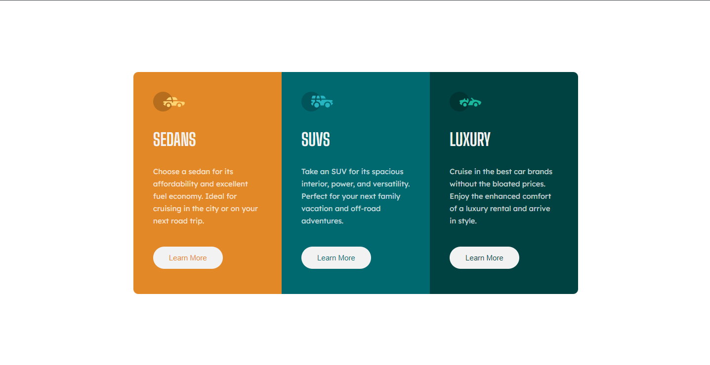

# Frontend Mentor - 3-column preview card component solution

This is a solution to the [3-column preview card component challenge on Frontend Mentor](https://www.frontendmentor.io/challenges/3column-preview-card-component-pH92eAR2-). Frontend Mentor challenges help you improve your coding skills by building realistic projects.

## Table of contents

- [Overview](#overview)
  - [The challenge](#the-challenge)
  - [Screenshot](#screenshot)
  - [Links](#links)
- [My process](#my-process)
  - [Built with](#built-with)
  - [What I learned](#what-i-learned)
  - [Useful resources](#useful-resources)
- [Author](#author)

**Note: Delete this note and update the table of contents based on what sections you keep.**

## Overview

### The challenge

Users should be able to:

- View the optimal layout depending on their device's screen size 375px and 1440px

### Screenshot



### Links

- Solution URL: https://github.com/samiuzaman/3-Column_Preview_Card-Component_Solution
- Live Site URL: https://samiuzaman.github.io/3-Column_Preview_Card-Component_Solution

## My process

### Built with

- Semantic HTML5 markup
- CSS custom properties
- Flexbox
- Mobile-first workflow

### What I learned

Use this section to recap over some of your major learnings while working through this project. Writing these out and providing code samples of areas you want to highlight is a great way to reinforce your own knowledge.

To see how you can add code snippets, see below:

```css
body {
  font-size: 15px;
}
section {
  display: flex;
  justify-content: center;
  align-items: center;
  height: 100vh;
  margin: auto 0;
}
```

### Useful resources

- ([Frontend Mentor](https://www.frontendmentor.io/))
- ([W3Schools](https://www.w3schools.com/))

## Author

- Frontend Mentor - [@samiuzaman](https://www.frontendmentor.io/profile/samiuzaman))
- Twitter - [@samiuzzaman201](https://www.twitter.com/samiuzzaman201)
- LinkedIn - [@samiuzaman/](https://www.linkedin.com/in/samiuzaman)
